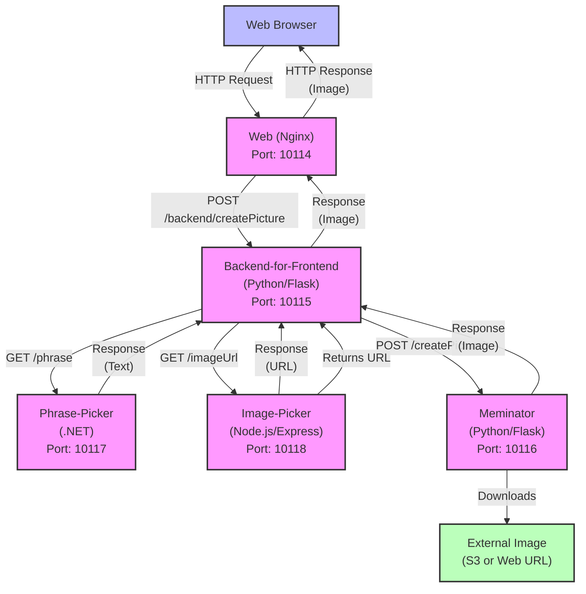

# Meminator Workshop

Open this repo in Codespaces (or clone it) and `./run` (docker compose up)

## github.com/honeycombio/meminator-workshop

This contains a sample application for use in various workshops. Note that "o11y" is a synonym for "observability". The application is implemented in various languages, so that you can play with instrumentation in any of them (or mix and match).

## Service Architecture



The application flow:

1. User clicks "GO" button in the web browser
2. Browser sends HTTP request to the Web service (Nginx)
3. Web service forwards the POST request to Backend-for-Frontend via nginx proxy (/backend/createPicture)
4. Backend-for-Frontend makes two parallel requests:
   - GET request to Phrase-Picker for a random phrase
   - GET request to Image-Picker for a random image URL
5. Backend-for-Frontend combines the phrase and image URL and sends a POST request to Meminator
6. Meminator downloads the image from the external source
7. Meminator applies the phrase text to the image using ImageMagick
8. Meminator returns the modified image to Backend-for-Frontend
9. Backend-for-Frontend returns the image to the Web service
10. Web service returns the image to the browser
11. Browser displays the generated meme image to the user

See it in action: [meminator.honeydemo.io](https://meminator.honeydemo.io)

It generates images by combining a randomly chosen picture with a randomly chosen phrase.

## Sessions using this repository

Advanced Instrumentation Workshop ([instructions](docs/advanced-instrumentation.md)) - a 1.5 hour workshop on improving the instrumentation in this app.

Instrumentation Strategies Session ([slides]())

## Running the application

Run this locally in docker-compose, sending traces to Honeycomb. Then you can practice improving the instrumentation for better observability.

If you don't have Docker locally, you can [run this in GitPod](https://gitpod.io/#https://github.com/honeycombio/meminator-workshop) or use Codespaces.

```
export HONEYCOMB_API_KEY="paste your api key here"
./run
```

### one-time setup

Clone this repository.

```bash
git clone https://github.com/honeycombio/meminator-workshop
```

Have Docker installed.

Define your Honeycomb API key. Add this to the middle of `.env`: (or export it in your shell)

```bash
HONEYCOMB_API_KEY="paste your api key here"
```

If you don't have an API key handy, here are the [docs](https://docs.honeycomb.io/get-started/configure/environments/manage-api-keys/#create-api-key).
If you want more stepping-through of how to get an API key, there are instructions for this in [Observaquiz](https://quiz.honeydemo.io); type in a name to get to the second page.

### run the app

`./run`

(this will run `docker compose` in daemon mode, and build containers)

Access the app:

[http://localhost:10114]()

after making changes to a service, you can tell it to rebuild just that one:

`./run [ meminator | backend-for-frontend | image-picker | phrase-picker ]`

### Try it out

Visit [http://localhost:10114]()

Click the "GO" button. Then wait.

## Improving the tracing

The app begins with automatic instrumentation installed. Test the app, look at the tracing... how could it be better?

Here's my daily for looking at the most recent traces:

- log in to Honeycomb
- (you should be in the same environment where you got the API key; if you're not sure, there's [my little app](https://honeycomb-whoami.glitch.me) that calls Honeycomb's auth endpoint and tells you.)

See the data:

- Click Query on the left navigation bar
- At the top, it says 'New Query in &lt;dropdown&gt;' -- click the dropdown and pick the top option, "All datasets in ..."
- click 'Run Query'. Now you have a count of all events (trace spans, logs, and metrics). If it's 0, you're not getting data :sad:
- If you want to take a look at all the data, click on 'Events' under the graph.

Get more info (optional):

- change the time to 'Last 10 minutes' to zoom in on just now.
- In the query, click under 'GROUP BY' and add 'service.name' as a group-by field. GROUP BY means "show me the values please."
- 'Run Query' again. (alt-enter also does it)
- Now see the table under the graph. You should see all 4 services from this app listed.

Get to a trace:

- In the graph, click on one of the lines. It brings up a popup menu.
- In the menu, click "View Trace"

This should take you to a trace view!

Does your trace include all 4 services?

### Checklist before starting the session

- additional tracing stuff that you'll add during the workshop should be commented out
- run your app locally
- make sure you're seeing traces in Honeycomb
- run the load generator in scripts/loadgen.sh

### updating code

See [MAINTENANCE.md](MAINTENANCE.md) for instructions on updating the cached starting-point containers on Dockerhub.
