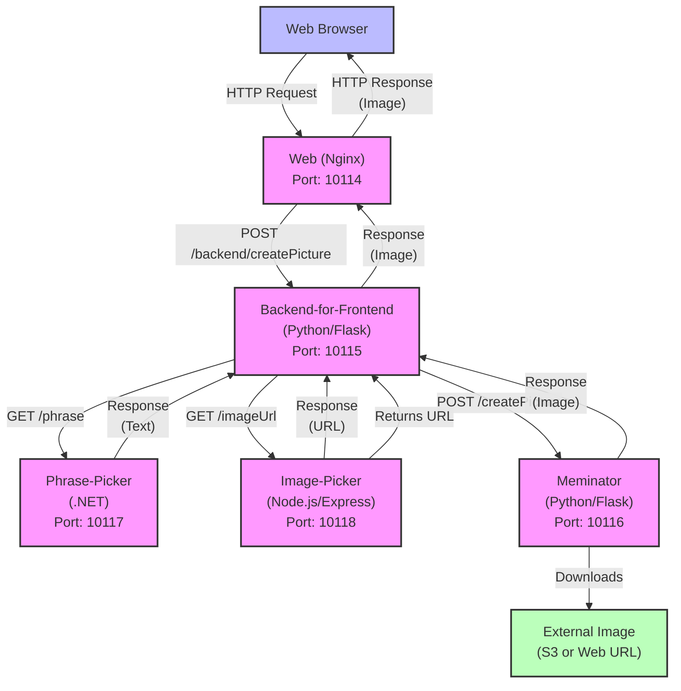

# Meminator Workshop

It's the Meminator 10114!

See the app live: [https://meminator.honeydemo.io]()

In the workshop, you've inherited responsibility for this legacy application. People are complaining that it is slow and fails sometimes.
You have no idea how it works. Good thing the team that it's instrumented with OpenTelemetry!

Your objective is to run the Meminator, point OpenTelemetry to Honeycomb.io, learn something from the traces it sends, and then improve those traces.
Make them express what matters in this application. Debug problems! Diagnose slowness! Understand this software and feel good about changing it.

## Run the meminator

### One-time setup

```bash
git clone https://github.com/honeycombio/meminator-workshop
```

Option 1, recommended for hotel wifi: [run this in GitPod](https://gitpod.io/#https://github.com/honeycombio/meminator-workshop) or in GitHub Codespaces (there's a button in the top right of the repo's [page](https://github.com/honeycombio/meminator-workshop)).

Option 2, clone this repo. `git clone https://github.com/honeycombio/meminator-workshop && cd meminator-workshop`
Log in to Docker so it doesn't rate-limit you.

Once you have the project open:

Define your Honeycomb API key. Add this to the middle of `.env`: (or export it in your shell)

```bash
HONEYCOMB_API_KEY="paste your api key here"
```

If you don't have a Honeycomb account yet, it's free! Sign up here. It won't ask for payment ever.

When you first sign up, it gives you an API key. Push the copy button.

If you already have a Honeycomb account, create a new environment for Meminator, and it'll give you an API key. For all other cases, herea re the [API key docs](https://docs.honeycomb.io/get-started/configure/environments/manage-api-keys/#create-api-key).

### run the app

`./run`

(this will run `docker compose` in daemon mode, and build containers)

Access the app:

[http://localhost:10114]()

after making changes to a service, you can tell it to rebuild just that one:

`./run [ meminator | backend-for-frontend | image-picker | phrase-picker ]`

### Optional: choose a language

The meminator is implemented in Node.js, Python, and .NET. The `./run` script runs a mixture of these.

You can choose to run all services in your favorite language instead. Substitute: `./run-one-language [python|nodejs|dotnet]`

## Service Architecture

hmm, is this up to date?



The application flow, as described by an AI after looking at a trace:

1. User clicks "GO" button in the web browser
2. Browser sends HTTP request to the Web service (Nginx)
3. Web service forwards the POST request to Backend-for-Frontend via nginx proxy (/backend/createPicture)
4. Backend-for-Frontend makes two parallel requests:
   - GET request to Phrase-Picker for a random phrase
   - GET request to Image-Picker for a random image URL
5. Backend-for-Frontend combines the phrase and image URL and sends a POST request to Meminator
6. Meminator downloads the image from the external source
7. Meminator applies the phrase text to the image using ImageMagick
8. Meminator returns the modified image to Backend-for-Frontend
9. Backend-for-Frontend returns the image to the Web service
10. Web service returns the image to the browser
11. Browser displays the generated meme image to the user

## Some workshops using this repository

Advanced Instrumentation Workshop ([instructions](docs/advanced-instrumentation.md)) - a 1.5 hour workshop on improving the instrumentation in this app.

Instrumentation Strategies Session ([slides]())

Support Complexity with Observability, [Explore Conference 2025](https://exploreddd.com)

## Improving the tracing

The app begins with automatic instrumentation installed. Test the app, look at the tracing... how could it be better?

Here's my daily for looking at the most recent traces:

- log in to Honeycomb
- (you should be in the same environment where you got the API key; if you're not sure where your API key points, there's [my little app](https://util.jessitron.honeydemo.io) that calls Honeycomb's auth endpoint and tells you.)

See the data:

- Click Query on the left navigation bar
- At the top, it says 'New Query in &lt;dropdown&gt;' -- click the dropdown and pick the top option, "All datasets in ..."
- click 'Run Query'. Now you have a count of all events (trace spans, logs, and metrics). If it's 0, you're not getting data :sad:
- If you want to take a look at all the data, click on 'Events' under the graph.

Get more info (optional):

- change the time to 'Last 10 minutes' to zoom in on just now.
- In the query, click under 'GROUP BY' and add 'service.name' as a group-by field. GROUP BY means "show me the values please."
- 'Run Query' again. (alt-enter also does it)
- Now see the table under the graph. You should see all 4 services from this app listed.

Get all the info (optional):

- Click the Explore Data tab
- expand a log line to look at the whole thing
- click some field names to add them to the log line
- try both the "table" and "log lines" view options (in the table header)

Get to a trace:

- In the graph, click on one of the lines. It brings up a popup menu.
- In the menu, click "View Trace"

This should take you to a trace view!

Does your trace include all 4 services... plus the web browser?

### Checklist before starting the session

- additional tracing stuff that you'll add during the workshop should be commented out
- run your app locally
- make sure you're seeing traces in Honeycomb
- run the load generator in scripts/loadgen.sh

### updating code

See [MAINTENANCE.md](MAINTENANCE.md) for instructions on updating the cached starting-point containers on Dockerhub.
